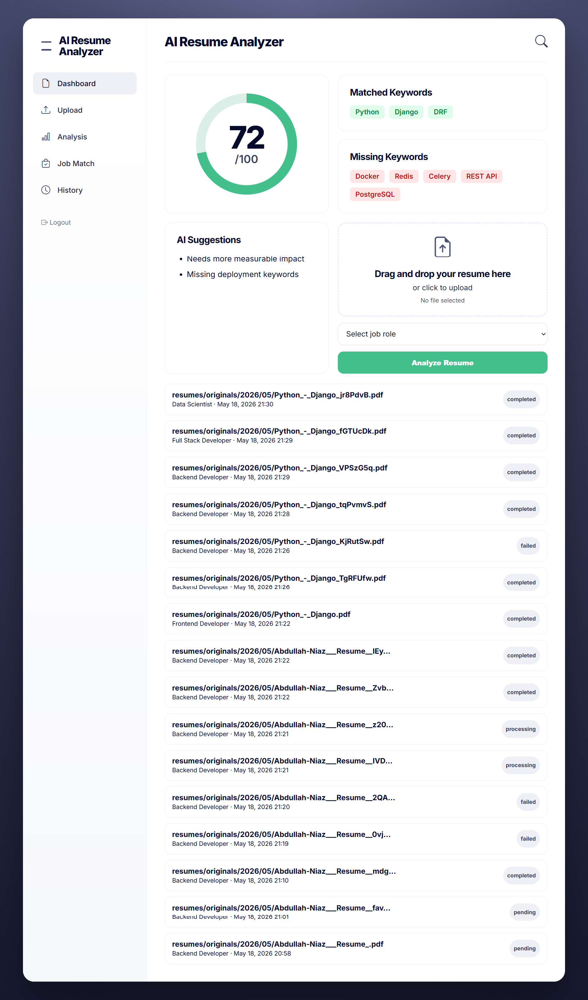

# AI Resume Analyzer & Career Booster SaaS

A modern AI-powered Resume Analyzer SaaS platform built with Django, DRF, Celery, Redis, SQLite/PostgreSQL, and Gemini AI.

This platform helps users upload their resumes, analyze ATS compatibility, optimize keywords, generate AI-powered improvements, and download enhanced resumes in PDF format.

Designed with a modern SaaS-style dashboard inspired by Linear, Vercel, and modern AI products.

---

# 🚀 Features

## AI Resume Analysis

* AI-powered ATS resume scoring
* Resume keyword optimization
* Job role alignment analysis
* AI-generated resume improvements
* Section-wise feedback
* Resume strengths & weaknesses

---

## Resume Upload System

* Upload PDF resumes
* Upload DOCX resumes
* Secure file validation
* Resume processing pipeline
* File storage management

---

## ATS Scoring Engine

Hybrid ATS scoring system:

* Rule-based analysis
* AI-powered analysis
* Final normalized ATS score
* Keyword density analysis
* Missing skills detection
* Resume formatting checks

---

## AI Resume Rewriter

The AI engine can:

* Rewrite weak bullet points
* Improve grammar and readability
* Add measurable achievements
* Optimize technical keywords
* Improve role targeting

Example:

### Before

```text
Worked on backend APIs
```

### After

```text
Developed and optimized Django REST APIs, improving response time by 35% and supporting scalable backend operations.
```

---

# 🎨 Modern SaaS UI

The project includes a fully redesigned modern dashboard UI:

* Glassmorphism-inspired layout
* Sidebar dashboard navigation
* Animated ATS score ring
* Upload drag-and-drop area
* AI suggestions panel
* Keyword analysis cards
* Modern responsive design
* Clean developer-focused aesthetics

---

# 🧠 AI Integration

Uses:

* Google Gemini API
* Structured JSON AI responses
* AI provider abstraction layer
* Automatic fallback handling
* Resume parsing + AI enhancement pipeline

Supported roles:

* Frontend Developer
* Backend Developer
* Full Stack Developer
* Data Analyst
* Data Scientist
* DevOps Engineer

---

# ⚙️ Tech Stack

## Backend

* Python
* Django
* Django REST Framework
* Celery
* Redis

## Database

* SQLite (local development)
* PostgreSQL (production-ready)

## Frontend

* Django Templates
* Bootstrap 5
* Custom SaaS UI styling
* Alpine.js / Vanilla JavaScript

## AI & Processing

* Gemini AI API
* PDF parsing
* DOCX parsing
* ReportLab PDF generation

---

# 📂 Project Structure

```text
resume_booster_saas/
│
├── apps/
│   ├── accounts/
│   ├── core/
│   └── resumes/
│       ├── services/
│       ├── templates/
│       ├── tasks.py
│       ├── models.py
│       ├── views.py
│       └── urls.py
│
├── config/
│   ├── settings.py
│   ├── urls.py
│   ├── celery.py
│   └── wsgi.py
│
├── static/
├── media/
├── templates/
├── requirements.txt
├── manage.py
└── README.md
```

---

# 🔥 Core Workflow

```text
Upload Resume
        ↓
Extract Resume Text
        ↓
ATS Analysis
        ↓
Gemini AI Processing
        ↓
Generate Improvements
        ↓
Generate Improved PDF
        ↓
Display Results Dashboard
```

---

# 🗄️ Database Models

Main models:

* User
* ResumeUpload
* ResumeAnalysis
* ImprovementResult
* JobRole
* ProcessingStatus

Each uploaded resume tracks:

* processing status
* ATS score
* AI output
* generated PDF
* timestamps
* errors

---

# 📡 API Endpoints

## Upload Resume

```http
POST /api/upload-resume/
```

## Resume Status

```http
GET /api/resume/<id>/status/
```

## Resume Analysis

```http
GET /api/resume/<id>/analysis/
```

## Download Improved Resume

```http
GET /api/resume/<id>/download/
```

---

# 🛠️ Installation

## 1. Clone Repository

```bash
git clone <repository-url>
cd resume_booster_saas
```

---

## 2. Create Virtual Environment

### Windows

```bash
python -m venv env
env\Scripts\activate
```

### Linux / Mac

```bash
python3 -m venv env
source env/bin/activate
```

---

## 3. Install Dependencies

```bash
pip install -r requirements.txt
```

---

# 🔑 Environment Variables

Create `.env` file in root directory:

```env
SECRET_KEY=your-secret-key
DEBUG=True

GEMINI_API_KEY=your_gemini_api_key
GEMINI_MODEL=gemini-1.5-flash
```

Get Gemini API key from:

[Google AI Studio](https://aistudio.google.com/app/apikey?utm_source=chatgpt.com)

---

# 🗃️ Database Setup

## SQLite (Default Local Setup)

```bash
python manage.py makemigrations
python manage.py migrate
```

---

## Create Superuser

```bash
python manage.py createsuperuser
```

---

# 👨‍💻 Add Job Roles

Run shell:

```bash
python manage.py shell
```

Paste:

```python
from apps.resumes.models import JobRole

roles = [
    "Frontend Developer",
    "Backend Developer",
    "Full Stack Developer",
    "Data Analyst",
    "Data Scientist",
    "DevOps Engineer",
]

for role in roles:
    JobRole.objects.get_or_create(name=role)
```

---

# ▶️ Run Development Server

```bash
python manage.py runserver
```

Open:

```text
http://127.0.0.1:8000
```

---

# ⚡ Celery Setup (Optional)

## Windows Local Testing

Use synchronous processing mode.

## Production Setup

Run Redis:

```bash
redis-server
```

Run Celery worker:

```bash
celery -A config worker -l info
```

---

# 📄 Resume Processing Pipeline

The app uses a modular processing architecture:

## Resume Parsing

* Extract text from PDF
* Extract text from DOCX
* Clean and normalize text

## ATS Engine

* Rule-based scoring
* Keyword analysis
* Section validation

## AI Processing

* Resume analysis
* Resume rewriting
* Suggestions generation

## PDF Generation

* Generate improved resume
* Export downloadable PDF

---

# 🧩 Services Layer

The app uses a clean service-based architecture:

```text
services/
├── ai.py
├── ats.py
├── parser.py
└── pdf.py
```

This keeps business logic separated from views.

---

# 🔒 Security Features

* File type validation
* Upload size limits
* Authenticated APIs
* Rate limiting
* Environment variable protection
* Secure media handling

---

# 📸 Screenshots

## Dashboard





---

# 🧪 Local Development Mode

For easier local testing:

* SQLite supported
* Fake AI fallback mode
* Synchronous processing mode
* No Redis required

This allows rapid development without full infrastructure setup.

---

# 🚀 Production Recommendations

For production deployment:

* PostgreSQL
* Redis
* Celery Workers
* Gunicorn
* Nginx
* Docker
* S3-compatible storage
* Error monitoring
* Logging system

---

# 📌 Current Status

## Implemented

* Resume upload
* ATS scoring
* AI integration
* PDF generation
* Dashboard UI
* Resume improvements
* Authentication
* API endpoints

## Planned Features

* Stripe subscriptions
* Resume templates
* Job description matching
* AI keyword extraction
* Resume history analytics
* Team accounts
* Email notifications

---

# 📈 Future Improvements

* Real-time progress updates
* WebSocket integration
* AI streaming responses
* Multi-language resume support
* Resume versioning
* Interview preparation assistant
* Cover letter generation

---

# 🤝 Contributing

Contributions are welcome.

Fork the repository and create a pull request for improvements, bug fixes, or new features.

---

# 📄 License

This project is licensed under the MIT License.

---

# 👨‍💻 Author

Built with Django, AI, and modern SaaS architecture principles.
